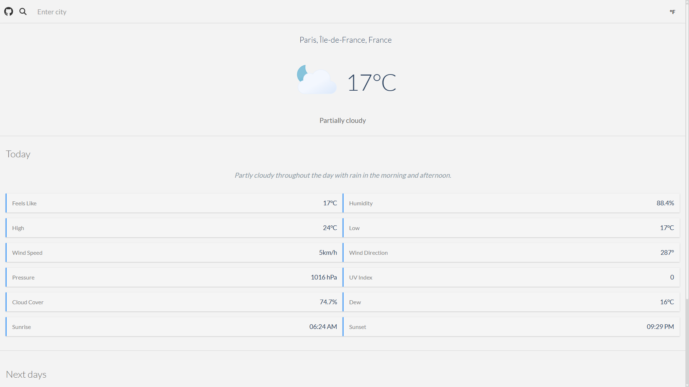

# The Odin Project - Full Stack JavaScript

## #7 Project: Weather App

Made with Webpack, Biome, HTML, CSS, JS.

A simple weather app.

### Features
- Current weather
- Today's weather
- 10 day forecast
- Unit conversion (C to F - km/h to mph)

